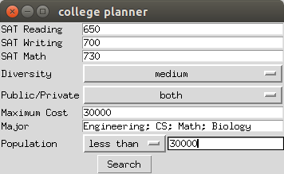
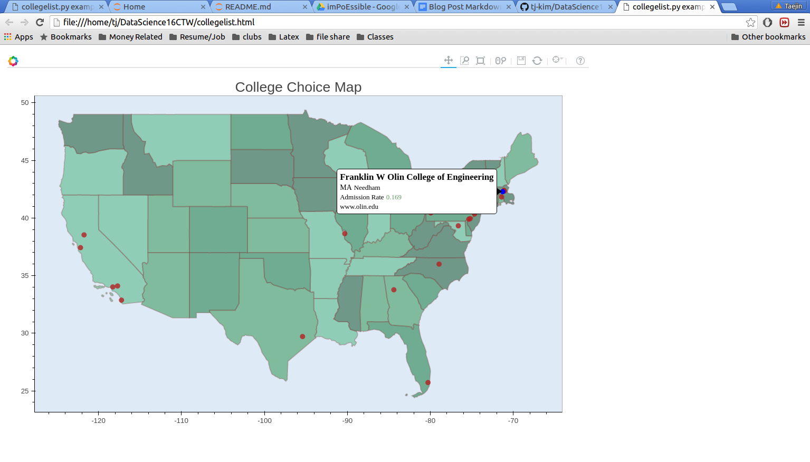

# Data Science Change the World

Jee Hyun Kim & TJ Kim

## Repository Guidelines

### Markdown Files

README.md: The current displayed file. Holds an overview of the github repo.

mid_project_checkin.md: Mid project analysis and update of the project.

### Ipython Notebooks

new_data_csv_book.ipynb: Ipython notebook with walkthrough and documentation through taking initial data csv downloaded from collegescorecard, and filtering out data columns we deem unuseful. Output is "new_college.csv" file, with filtered out columns.

alg_finalized_1_1.ipynb : Ipython notebook with walkthrough and documentation on algorithms used to filter out colleges through user preference input.

majoroveryears.ipynb: Ipython notebook with data exploration and visualization of colleges over the years. There is a focus on growth and decline of college major rates throughout the years. Although we altered our minimum viable product, we still wanted to stay loyal to our original goal and graph data on axis.

### Py Files

college.py: Equivalent to alg_finalized_1_1 except put into a py file. This allows other py files to import it and use it. Holds algorithms that filters colleges out based upon user input.

college_gui.py: Uses Tkinter library to build a graphic user interface for users to to input their preferences and information. This file imports college_map.py and college.py for final using.

college_map.py: Uses Bokeh library to generate map with schools printed onto map of US.

### CSV Files
new_college.csv: Output of new_data_csv_book.ipynb. It holds filtered information of the entire collegescorecard dataset.

CollegeScorecardDataDictionary-09-12-2015.csv: Holds dictionary of every column name and description in original collegescorecard dataset. We use it in alg_finalized_1_1.ipynb and college.py to map the column names of different major to definitions.

majors.csv: Filtered from the original collegescorecard dataset, this file holds all the columns of each colleges major percentages. Used for majoroveryears.ipynb.

### PDF Files

ChangetheWorldProposal.pdf: Initial Project Proposal that outlines what we want to accomplish for this project.

FinalOutputandReflection.pdf: Final Project Reflection that analyzes our project process and reflects on how we performed.

## Alterations to the Project Proposal

After working on the project, we decided to change our MVP and final output. Our initial goals mostly included:

- Creating a single axis spectrum graph with a selectable characteristic to map colleges onto it.

We wanted to alter that goal into something else:

- Mapping the final college locations onto a map of the US

For the following reasons:

- People did not understand when we attempted to explain our initial idea.
- It allowed us to emphasize the data more graphically and visually appealing.
- Helped us learn Bokeh, a new a slightly challenging library to implement initially.

## Example Use of College Finder

Here we use the college finder ourselves. Initially we run with python college_gui.py, and input our preferences in the graphic user interface as such.

After we hit the search button, a new tab in the internet opens! It is a map of the US with the colleges marked on it as dots. From here, users can hover over the dots to get further information about each college such as name and website. An example screenshot is presented below.

